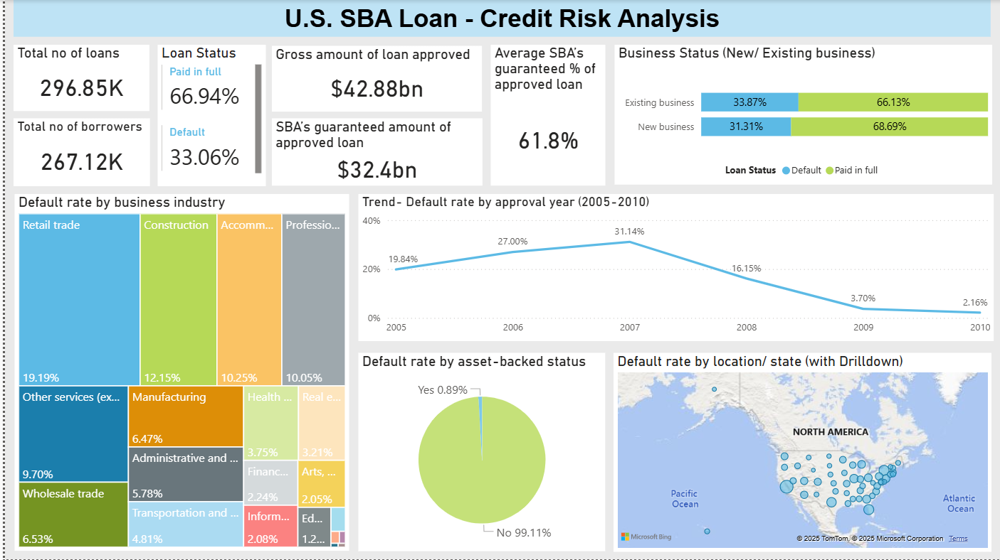
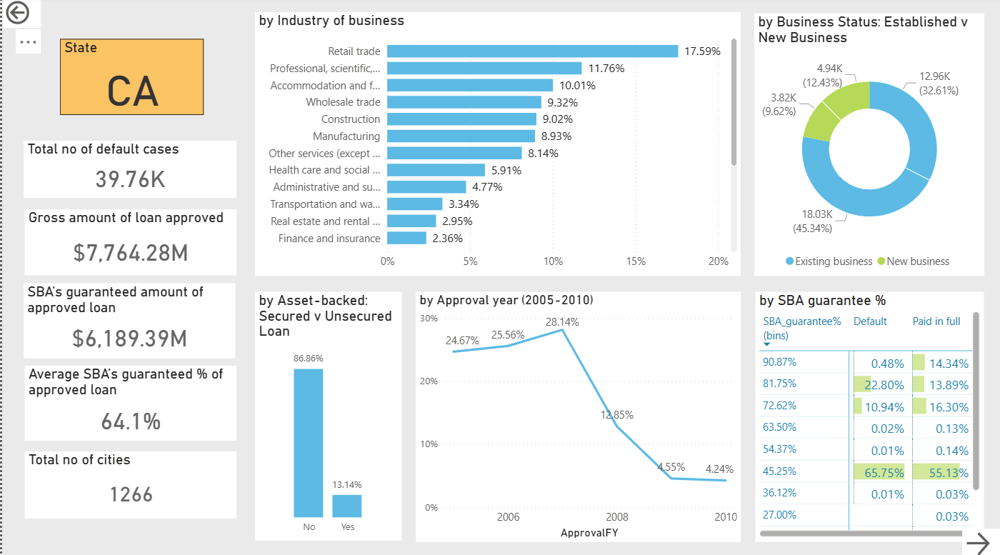

# **SBA Loan Credit Risk Analysis – Financial Services**

## 📌 *Project Overview*
This project presents an end-to-end credit risk analysis for U.S. Small Business Administration (SBA) loans issued between 2005 and 2010, aimed at evaluating internal lending guidelines for small- and medium-sized enterprises. Using Power BI and Power Query, the analysis identifies high-risk borrower segments, assesses the impact of SBA guarantee levels, and provides data-driven recommendations to minimise default risk and improve loan portfolio quality.

## 🔍 *Business Questions*

- What is the overall default rate within the SBA loan portfolio from 2005–2010?

- How does loan performance vary by state, industry, and business type?

- What is the relationship between SBA guarantee percentage, collateral, and default risk?

- Which borrower categories and loan types contribute most to losses?

- How can lending guidelines be revised to reduce future default rates?

Detail: Full business objectives and exploratory steps are documented in the accompanying Power BI file and project report.

## 📊 *Dataset*
The dataset comprises loan records from 2005 to 2010, sourced from the official SBA Loan Performance dataset on Kaggle

Dataseet: https://www.kaggle.com/mirbektoktogaraev/should-this-loan-be-approved-or-denied

### Key Attributes:

Loan Details: Loan amount, approval date, gross disbursement, balance, SBA guarantee percentage

Borrower Profile: Industry, business age, location (state)

Performance Indicators: Loan status (paid, defaulted, charged-off), collateral type, secured/unsecured classification

## 🛠️ *Tools & Technologies*

- **Power Query:** Data cleaning, anomaly detection, and feature engineering

- **Power BI:** Data modelling, DAX calculations, interactive dashboards, and geographic drilldowns

- **Excel (Supplementary):** Data validation and KPI cross-checks

### 📈 Approach

**1. Data Collection & Preparation**

- Extracted and cleaned raw loan data from Kaggle.

- Handled missing and inconsistent entries; removed anomalies and duplicates.

- Engineered new variables such as SBA_Guarantee%, Loan Status, and Industry Code for better analytical clarity.

**2. Exploratory Data Analysis (EDA)**

- Evaluated loan distribution by year, amount, industry, and region.

- Assessed default proportions across borrower profiles and states.

- Identified trends in SBA guarantee coverage relative to loan performance.

**3. Data Transformation (Power Query)**

- Removed outliers and non-informative fields.

- Standardised formats for numeric and categorical variables.

- Created calculated columns for percentage-based indicators and loan classification.

**4. Data Modelling & Visualization (Power BI)**

- Built an interactive Power BI dashboard with drill-down capabilities:

- Portfolio Overview: Key loan metrics and guarantee distribution

- Geographic Breakdown: State-level default analysis with map visuals

- Industry Risk Dashboard: Comparison of charge-off rates across sectors

- SBA Guarantee View: Relationship between guarantee coverage and defaults

- Incorporated tooltips and filters to enable granular exploration.

## 🔍 *Key Findings*

- The overall default rate across the SBA loan portfolio was ~17.6%.

- High-risk states (California, New York, Florida) accounted for over 40% of total defaults, indicating regional concentration of loan losses.

- Retail trade and construction industries showed the highest default incidence, representing roughly 55% of total charged-off loans.

- Loans to new businesses (<2 years old) were twice as likely to default as those to established firms.

- Unsecured loans demonstrated significantly higher charge-off rates compared to collateralised ones.

- The average SBA guarantee ranged from 75%–85%, consistent with program standards, but high guarantees did not always prevent losses when underwriting quality was poor.

## ⚠️ *Challenges Identified*

- Over-concentration of risky loans in select geographies and industries.

- Weak performance among startup borrowers due to limited operating history.

- High dependency on SBA guarantees rather than borrower repayment capacity.

- Insufficient differentiation between secured and unsecured lending terms.

## ✅ *Recommendations*

- Tighten Credit in High-Risk Segments: Implement stricter credit assessments and enhanced collateral requirements for borrowers in high-default states and volatile industries.

- Prioritise Established Businesses: Shift a larger portion of lending towards firms with proven operational track records (>2 years).

- Collateral Policy Reinforcement: Enforce mandatory collateral or personal guarantees for unsecured loans.

- Refine Guarantee Utilisation: Use the SBA guarantee strategically to support marginally bankable borrowers, not as a blanket risk offset.

- Implement Dynamic Credit Scoring: Continuously monitor loan performance data to recalibrate credit scoring models by sector and geography.

## 💼 *Outcomes*

- Designed an interactive Power BI dashboard that provides state-wise, industry-wise, and guarantee-based risk visibility for SBA loans.

- Enabled data-driven discussions with credit risk management teams on policy revision and exposure control.

- Findings informed updates to underwriting procedures projected to reduce default exposure by ~12% through targeted portfolio adjustments.

- Produced a professional business report summarising insights and action plans for senior management and external stakeholders.

## *Dashboard*

